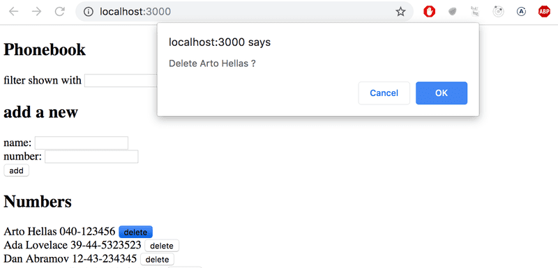
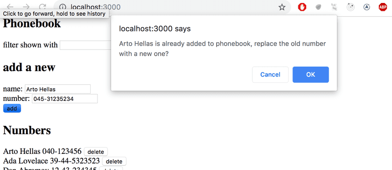

# Exercises 2.15.-2.18.

## 2.15: Phonebook step7

Let's return to our phonebook application.

Currently, the numbers that are added to the phonebook are not saved to a backend server. Fix this situation.

## 2.16: Phonebook step8

Extract the code that handles the communication with the backend into its own module by following the example shown earlier in this part of the course material.

## 2.17: Phonebook step9

Make it possible for users to delete entries from the phonebook. The deletion can be done through a dedicated button for each person in the phonebook list. You can confirm the action from the user by using the [window.confirm](https://developer.mozilla.org/en-US/docs/Web/API/Window/confirm) method:



The associated resource for a person in the backend can be deleted by making an HTTP DELETE request to the resource's URL. If we are deleting e.g. a person who has the id 2, we would have to make an HTTP DELETE request to the URL localhost:3001/persons/2. No data is sent with the request.

You can make an HTTP DELETE request with the [axios](https://github.com/axios/axios) library in the same way that we make all of the other requests.

**NB**: You can't use the name delete for a variable because it's a reserved word in JavaScript. E.g. the following is not possible:

```js
// use some other name for variable!
const delete = (id) => {
  // ...
}
```

## 2.18*: Phonebook step10

Change the functionality so that if a number is added to an already existing user, the new number will replace the old number. It's recommended to use the HTTP PUT method for updating the phone number.

If the person's information is already in the phonebook, the application can confirm the action from the user:


