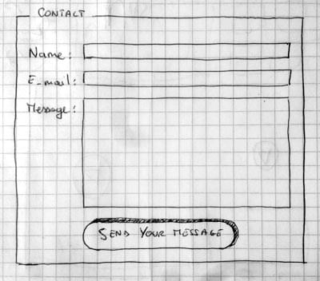

# What are web forms?

**Web forms** are one of the main points of interaction between a user and a web site or application. Forms allow users to enter data, which is generally sent to a web server for processing and storage, or used on the client-side to immediately update the interface in some way (for example, add another item to a list, or show or hide a UI feature).

A web form's HTML is made up of one or more **form controls** (sometimes called **widgets**), plus some additional elements to help structure the overall from -- they are often referred to as **HTML forms**. The controls can bee single or multi-line text fields, dropdown boxes, buttons, checkboxes, or radio buttons, and are mostly created using the `<input>` element, although there are some other elements to learn about too.

Form controls can also be programmed to enforce specific formats or values to be entered (**form validation**), and paired with text labels that describe their purpose to both sighted and visually impaired users.

## Designing your form

Before starting to code, it's always better to step back and take the time to think about your form. Designing a quick mockup will help you to define the right set of data you want to ask your user to enter. From a user experience (UX) point of view, it's important to remember that the bigger your form, the more  you risk frustrating people and losing users. Keep it simple and stay focused: ask only for the data your absolutely need.

Designing forms is an important step when your are building a site or application. If you want to dig into that topic you should read the following articles:

- Smashing Magazine has some [good article about forms UX](https://www.smashingmagazine.com/2018/08/ux-html5-mobile-form-part-1/), including an older but still relevant [Extensive Guide to Web Form Usability](https://www.smashingmagazine.com/2011/11/extensive-guide-web-form-usability/) article.
- UXMatters is also a very thoughtful resource with good advice from [basic best practices](https://www.uxmatters.com/mt/archives/2012/05/7-basic-best-practices-for-buttons.php) to complex concerns such as [multi-page forms](https://www.uxmatters.com/mt/archives/2010/03/pagination-in-web-forms-evaluating-the-effectiveness-of-web-forms.php).

In this article, we'll build a simple contact form. Let's make a rough sketch.



Our form will contain three text fields and one button. We are asking the user for their name, their e-mail and the message they want to send. Hitting the button will send their data to a web server.

## Active learning: Implementing our form HTML

Ok, let's have a go at creating the HTML for our form. We will use the following HTML elements: `<form>`, `<label>`, `<input>`, `<textarea>`, and `<button>`.

#### The `<form>` element

All forms start with a `<form>` element, like this:

```html
<form action="/my-handling-form-page" method="post">

</form>
```

This element formally defines a form. It's a container element like a `<section>` or `<footer>` element, but specifically for containing forms; it also supports some specific attributes to configure the way the form behaves. All of its attributes are optional, but it's standard practice to always set at least the **action** and **method** attributes:

- The **action** attribute defines the location (URL) where the form's collected data should bu sent when it is submitted.
- The **method** attribute defines which HTTP method to send the data with (usually) **get** or **post**).

For now, add the above `<form>` element into your HTML `<body>`.

### The `<label>`, `<input>`, and `<textarea>` elements

Our contact for is not complex: the data entry portion contains three text fields, each with a corresponding `<label>`:

- The input 